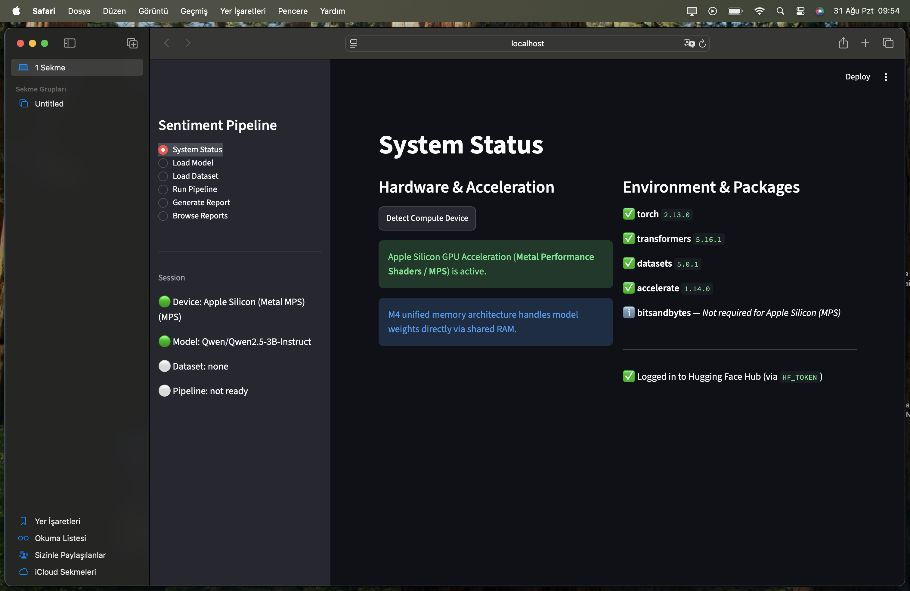
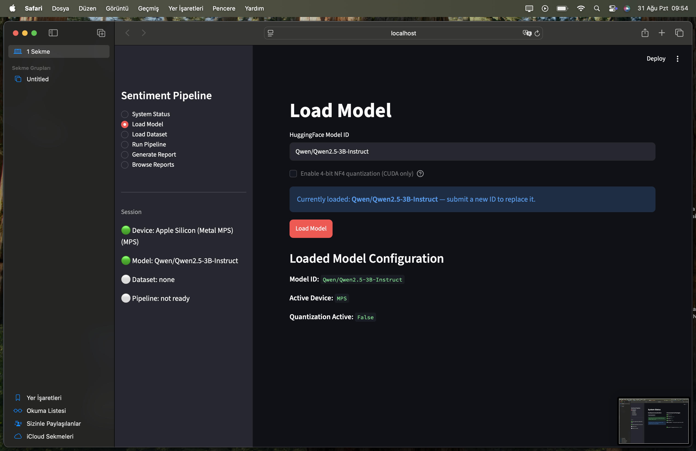
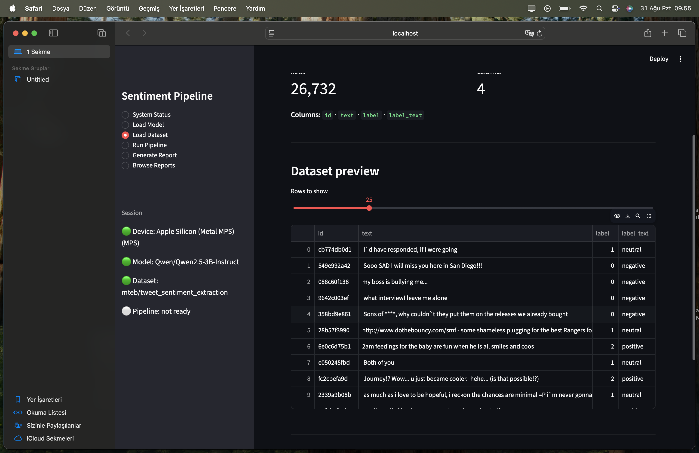
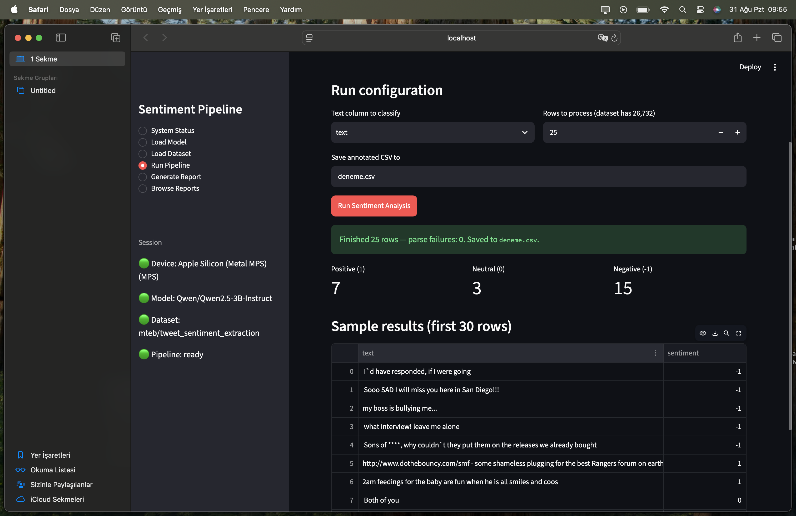
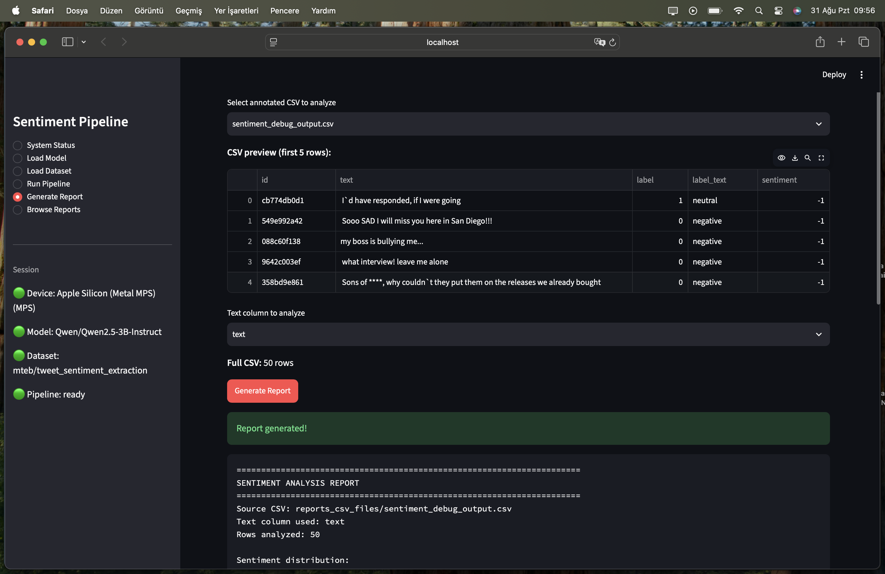
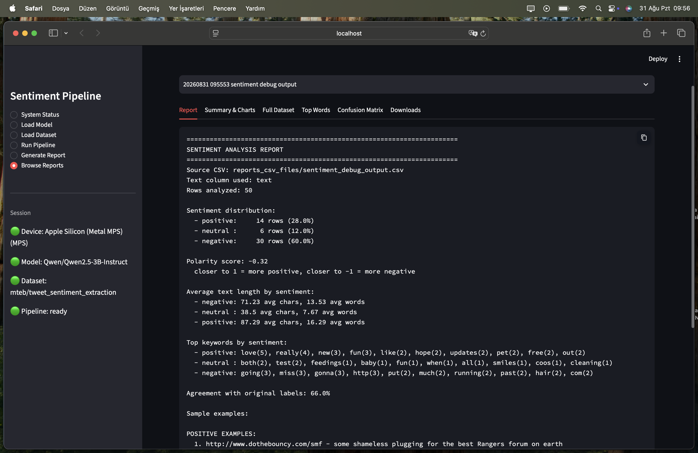

# 🚀 End-to-End Enterprise AI Sentiment Analysis Pipeline & Automated Intelligence Platform

An enterprise-grade, hardware-adaptive natural language processing and reporting platform designed to transform raw, unstructured customer interactions into actionable business intelligence. Modern organizations handle massive volumes of incoming textual feedback across support tickets, customer satisfaction surveys, app store reviews, and social media channels. Manually categorizing this influx is resource-heavy, subjective, and difficult to scale across distributed operational units. This solution bridges the gap between state-of-the-art causal language models and production-ready enterprise infrastructure by providing a resilient, end-to-end framework capable of running on heterogeneous compute environments with zero manual reconfiguration.

At its core, the platform incorporates a dynamic hardware dispatch mechanism that inspects the host runtime at initialization. It dynamically allocates execution across NVIDIA CUDA GPUs with 4-bit NormalFloat quantization via BitsAndBytes, Apple Silicon unified memory architectures through native Metal Performance Shaders (MPS) in FP16 precision, or multi-threaded CPU environments in FP32. This hardware abstraction ensures organizations can deploy the pipeline on developer workstations, specialized on-premise compute nodes, or cloud instances without modifying code.

The inference lifecycle uses high-throughput batched tensor processing to bypass the severe latency constraints of sequential processing. It parses open-weight causal models, such as the Qwen2.5 instruction-tuned series, to extract granular sentiment classifications with deterministic structured parsing. Beyond classification, the system acts as an analytical reporting engine. It evaluates sentiment distributions, computes normalized polarity scores, identifies top descriptive keywords across emotional categories, and benchmarks predictions against ground-truth labels using automated confusion matrices.

The pipeline includes an interactive Streamlit web dashboard alongside a headless Python API. Stakeholders can inspect datasets, monitor hardware metrics, configure inference parameters, and explore visual analytical summaries. By packaging model quantization, dataset management, batched inference, automated reporting, and interactive data visualization into a unified architecture, the platform enables enterprises to extract strategic insights from their textual data with speed, accuracy, and operational efficiency.

---

## 📸 Platform Interface & Live Application Flow

<div align="center">

| ⚙️ 1. System Status & Hardware Accelerator Diagnostics | 🤖 2. Model Loader & Device Configuration |
| :---: | :---: |
|  |  |

| 🔍 3. Dataset Exploration & Dynamic Row Preview | ⚡ 4. Batched Sentiment Inference Engine |
| :---: | :---: |
|  |  |

| 📊 5. Automated Analytical Report Generation | 📈 6. Comprehensive Metrics & Lexical Analytics |
| :---: | :---: |
|  |  |

</div>

---

## 🌟 Key Features

* **Universal Hardware Orchestration:** Automatically detects and routes workloads to **NVIDIA CUDA**, **Apple Silicon MPS (Metal)**, or **Host CPU** with platform-specific memory optimizations.
* **4-Bit NF4 Quantization:** Employs BitsAndBytes NF4 quantization under CUDA, drastically reducing VRAM overhead while preserving classification fidelity.
* **Vectorized Batched Inference:** High-throughput batch processing built directly into the text-generation engine for large-scale datasets.
* **Comprehensive Reporting Suite:** Automatically exports plain-text summaries, JSON metrics, CSV files, confusion matrices, and keyword frequency distributions.
* **Interactive Business Dashboard:** Full-featured Streamlit UI featuring system diagnostics, dataset exploration, batch inference controls, and Plotly visualization tabs.

---

## 🏗️ Architecture & Project Structure

```text
├── docs/
│   └── assets/                    # Platform screenshots and documentation media
│       ├── 01_system_status.png
│       ├── 02_load_model.png
│       ├── 03_load_dataset.png
│       ├── 04_run_pipeline.png
│       ├── 05_generate_report.png
│       └── 06_browse_reports.png
├── app.py                         # Streamlit multi-page dashboard & visualization engine
├── hardware_preparation.py        # Compute accelerator detection (CUDA / MPS / CPU)
├── hugging_face_authentication.py # Secure Hugging Face Hub token & credential manager
├── model_manager.py               # Hardware-aware LLM loader & tokenizer orchestrator
├── dataset_loader.py              # Memory-efficient Hugging Face dataset handler
├── sentiment_pipeline.py          # Batched inference engine & analytical reporting core
├── requirements-win.txt           # Windows / CUDA package dependencies
├── requirements-mac.txt           # macOS (Apple Silicon M-Series) dependencies
└── reports/                       # Auto-generated analytical reports & JSON summaries
